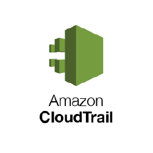
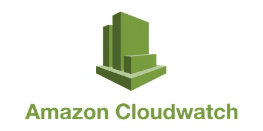
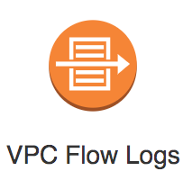
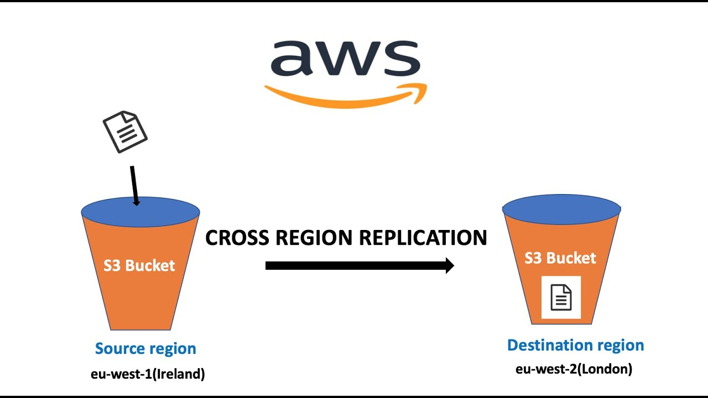
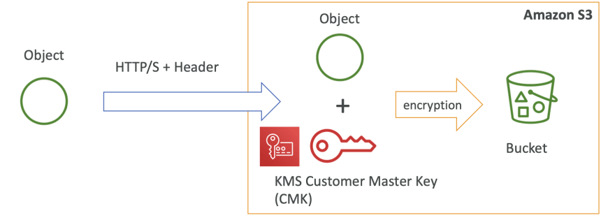

# Securite-du-cloud-computing GROUP 5

Ce projet GitHub contient des ressources et des fichiers de configuration pour vous aider à apprendre et à travailler avec Terraform. Terraform est une infrastructure as code (IaC) qui permet de créer, gérer et automatiser l'infrastructure cloud de manière efficace et reproductible.

## Table des Matières

1. [Prérequis](#prérequis)
2. [Cloudtrail](#1_cloudtrail)
3. [CloudWatchEvent](#2_cloudwatchevent)
4. [VPCFlowLog](#3_vpcflowlog)
5. [S3_Presign_URL](#4_s3_presign_url)
6. [S3_Log](#5_s3_log)
7. [S3_Cross_Region](#6_s3_cross_region)
8. [S3_KMS](#7_s3_kms)

## Prérequis

Avant de commencer, assurez-vous d'avoir installé Terraform sur votre machine. Vous pouvez suivre les instructions d'installation [ici](https://learn.hashicorp.com/tutorials/terraform/install-cli).

## 1_Cloudtrail

Dans cette section, vous allez effectuer l'installation initiale de Terraform et configurer votre environnement de développement pour CloudTrail. CloudTrail enregistre les événements liés aux comptes AWS, fournissant une piste d'audit des actions effectuées dans votre compte.

- Naviguez vers le dossier [Cloudtrail](./1_Cloudtrail) pour obtenir des instructions détaillées.

## 2_CloudWatchEvent

Dans cette section, vous allez créer votre première infrastructure avec Terraform pour CloudWatchEvent. Vous découvrirez comment déployer des règles d'événements dans Amazon CloudWatch Events pour déclencher des actions en réponse à certains événements dans votre environnement AWS.

- Naviguez vers le dossier [CloudWatchEvent](./2_CloudWatchEvent) pour obtenir des instructions détaillées.

## 3_VPCFlowLog

Cette section vous guidera à travers des concepts avancés de Terraform pour VPCFlowLog, notamment l'utilisation de variables et l'application de bonnes pratiques pour organiser votre code. Les journaux de flux VPC capturent les métadonnées sur le trafic réseau IPv4 dans votre VPC.

- Naviguez vers le dossier [VPCFlowLog](./3_VPCFlowLog) pour obtenir des instructions détaillées.

## 4_S3_Presign_URL

Dans cette section, vous apprendrez à travailler avec S3_Presign_URL en utilisant Terraform. Vous générerez des URL de préinscription pour les objets dans Amazon S3, permettant un accès temporaire aux ressources sans nécessiter d'authentification permanente.

- Naviguez vers le dossier [S3_Presign_URL](./4_S3_Presign_URL) pour obtenir des instructions détaillées.

## 5_S3_Log

Cette section vous guidera à travers des concepts avancés de Terraform pour S3_Log, notamment l'utilisation de variables et l'application de bonnes pratiques pour organiser votre code. Vous configurerez les journaux d'accès Amazon S3, offrant une visibilité sur les demandes effectuées sur les objets S3.

- Naviguez vers le dossier [S3_Log](./5_S3_Log) pour obtenir des instructions détaillées.

## 6_S3_Cross_Region

Dans cette section, vous apprendrez à travailler avec S3_Cross_Region en utilisant Terraform. Vous configurerez la réplication d'objets S3 entre différentes régions AWS.

- Naviguez vers le dossier [S3_Cross_Region](./6_S3_Cross_Region) pour obtenir des instructions détaillées.

## 7_S3_KMS

Cette dernière section vous guidera à travers des concepts avancés de Terraform pour S3_KMS. Vous verrez comment mettre en place un environnement collaboratif pour gérer l'infrastructure en toute sécurité, en particulier en utilisant AWS Key Management Service (KMS) pour la gestion des clés de chiffrement des objets stockés dans Amazon S3.

- Naviguez vers le dossier [S3_KMS](./7_S3_KMS) pour obtenir des instructions détaillées.

---
## [Cliquer sur ici pour voir les TPs](https://github.com/Morzomb/Securite-du-cloud-computing/)
