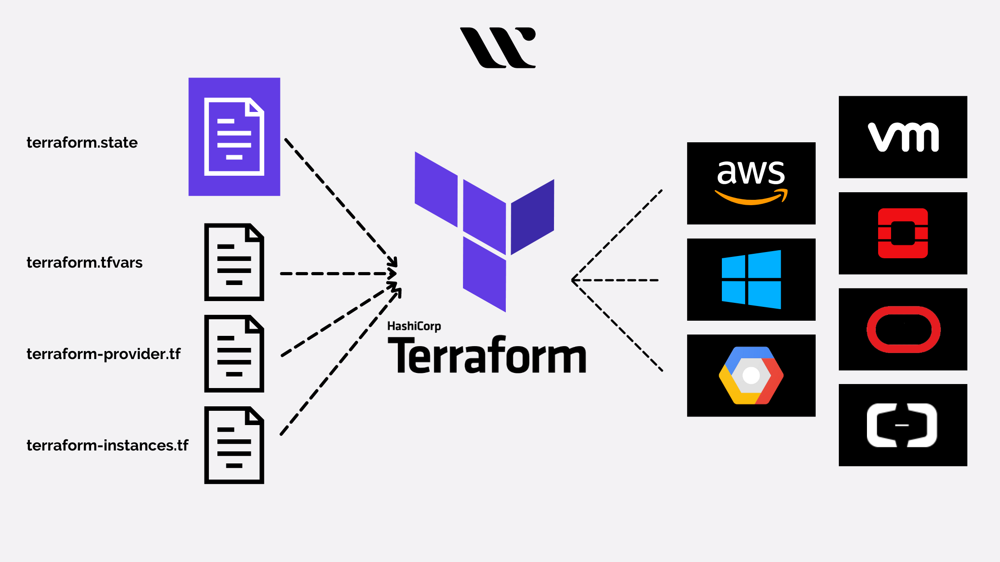

# Securite-du-cloud-computing

Ce projet GitHub contient des ressources et des fichiers de configuration pour vous aider à apprendre et à travailler avec Terraform. Terraform est une infrastructure as code (IaC) qui permet de créer, gérer et automatiser l'infrastructure cloud de manière efficace et reproductible.

## Table des Matières

1. [Prérequis](#prérequis)
2. [TP0 - Préparation](#tp0---préparation)
3. [TP1 - Prise en Main](#tp1---prise-en-main)
4. [TP2 - Utilisation Avancée](#tp2---utilisation-avancée)
5. [TP3 - Travail Collaboratif](#tp3---travail-collaboratif)

## Prérequis

Avant de commencer, assurez-vous d'avoir installé Terraform sur votre machine. Vous pouvez suivre les instructions d'installation [ici](https://learn.hashicorp.com/tutorials/terraform/install-cli).

## TP0 - Préparation

Dans ce TP, vous allez effectuer l'installation initiale de Terraform et configurer votre environnement de développement.

- Naviguez vers le dossier [TP0](./TP0) pour obtenir des instructions détaillées.

## TP1 - Prise en Main

Dans ce TP, vous allez créer votre première infrastructure avec Terraform. Vous découvrirez comment déployer des ressources de base dans le cloud.

- Naviguez vers le dossier [TP1](./TP1) pour obtenir des instructions détaillées.

## TP2 - Utilisation Avancée

Ce TP vous guidera à travers des concepts avancés de Terraform, notamment l'utilisation de variables et l'application de bonnes pratiques pour organiser votre code.

- Naviguez vers le dossier [TP2](./TP2) pour obtenir des instructions détaillées.

## TP3 - Travail Collaboratif

Dans ce dernier TP, vous apprendrez à travailler en équipe en utilisant Terraform. Vous verrez comment mettre en place un environnement collaboratif pour gérer l'infrastructure en toute sécurité.

- Naviguez vers le dossier [TP3](./TP3) pour obtenir des instructions détaillées.

---
## TP Fait par Ilies BEHUET et Paul LAUZERO [Cliquer sur ici pour voir les TPs](https://github.com/Morzomb/TerraForm_aws)
